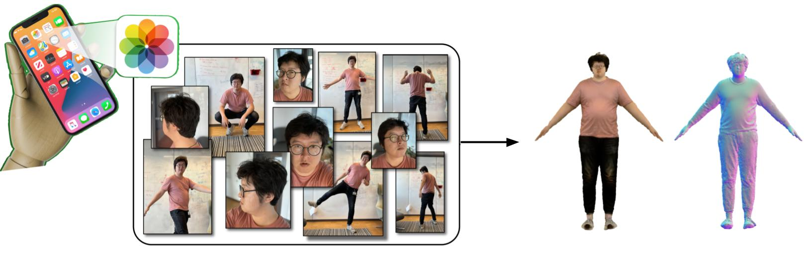

<p align="center">

  <h2 align="center">PuzzleAvatar:<br> Assembly of Avatar from Unconstrained Photo Collections</h2>
  <p align="center">
    <a href="https://xiuyuliang.cn/"><strong>Yuliang Xiu</strong></a>
    ·
    <a href="https://judyye.github.io/"><strong>Yufei Ye</strong></a>
    ·
    <a href="https://itszhen.com/"><strong>Zhen Liu</strong></a>
    ·
    <a href="https://dtzionas.com/"><strong>Dimitris Tzionas</strong></a>
    ·
    <a href="https://ps.is.mpg.de/person/black"><strong>Michael J. Black</strong></a>
    <br>
  </p>
  <h3 align="center">SIGGRAPH Asia 2024 (Journal Track)</h3>
  <div align="center">
    <!-- <video autoplay loop muted src="" type=video/mp4>
    </video> -->
    
  </div>

  <p align="center">
  </br>
    <a href="https://arxiv.org/abs/2405.14869">
      
    </a>
    <a href='https://puzzleavatar.is.tue.mpg.de/'>
      </a>
    <a href="https://youtu.be/0hpXH2tVPk4"></a>
  </p>
</p>

Can we get a personalized 3D avatar by just uploading unconstrained photo collections from our albums (any number of photos, in any poses, from any views, with any cropping or occlusion)? It used to be challenging, but now you can do it with PuzzleAvatar.

<br/>


## News :triangular_flag_on_post:

- [2024/09/10] We released the code of [PuzzleAvatar](https://github.com/YuliangXiu/PuzzleAvatar).
- [2024/05/23] We released the arXiv of [PuzzleAvatar](https://arxiv.org/abs/2405.14869).


<br/>

## Installation

Please follow the [Installation Instruction](docs/install.md) to setup all the required packages.

## Dataset

<div align="center">
    
</div>


Coming soon...

## Getting Started

1. Set up the paths in `scripts/env.sh`.
2. Run PuzzleAvatar (Grounded-SAM $\rightarrow$ PuzzleBooth $\rightarrow$ SDS, takes about 4 hours)
```shell
bash scripts/run.sh data/human/yuliang results/human/yuliang human_yuliang
```

<div align="center">
    
</div>

The results will be saved in the experiment folder `results/human/yuliang`


## Citation

```bibtex
@article{xiu2024puzzleavatar,
  title={PuzzleAvatar: Assembling 3D Avatars from Personal Albums},
  author={Xiu, Yuliang and Ye, Yufei and Liu, Zhen and Tzionas, Dimitrios and Black, Michael J},
  journal={ACM Transactions on Graphics (TOG)},
  year={2024},
  publisher={ACM New York, NY, USA}
}
```

## Acknowledgment
This implementation is mainly built based on [TeCH](https://github.com/huangyangyi/TeCH), [BOFT-DreamBooth](https://github.com/huggingface/peft/blob/main/examples/boft_dreambooth/train_dreambooth.py), [Stable Dreamfusion](https://github.com/ashawkey/stable-dreamfusion), [ECON](https://github.com/YuliangXiu/ECON)

This project has received funding from the European Union’s Horizon 2020 research and innovation programme under the Marie Skłodowska-Curie grant agreement No.860768 ([CLIPE Project](https://www.clipe-itn.eu)).

## Contributors

Kudos to all of our amazing contributors! PuzzleAvatar thrives through open-source. In that spirit, we welcome all kinds of contributions from the community.

<a href="https://github.com/yuliangxiu/PuzzleAvatar/graphs/contributors">
  
</a>

_Contributor avatars are randomly shuffled._

---

<br>

## License

This code and model are available for non-commercial scientific research purposes as defined in the [LICENSE](LICENSE) file. By downloading and using the code and model you agree to the terms in the [LICENSE](LICENSE).

## Disclosure

MJB has received research gift funds from Adobe, Intel, Nvidia, Meta/Facebook, and Amazon. MJB has financial interests in Amazon, Datagen Technologies, and Meshcapade GmbH. While MJB is a part-time employee of Meshcapade, his research was performed solely at, and funded solely by, the Max Planck Society.

## Contact

For technical questions, please contact yuliang.xiu@tue.mpg.de

For commercial licensing, please contact ps-licensing@tue.mpg.de
