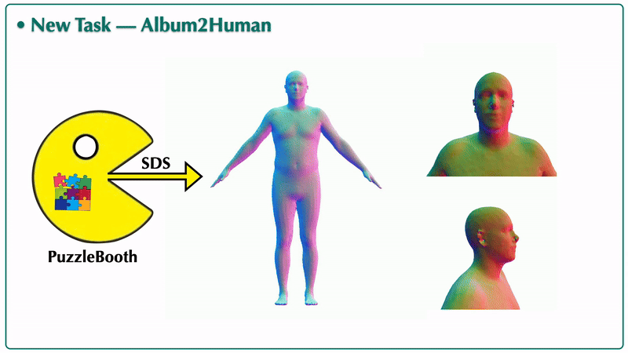
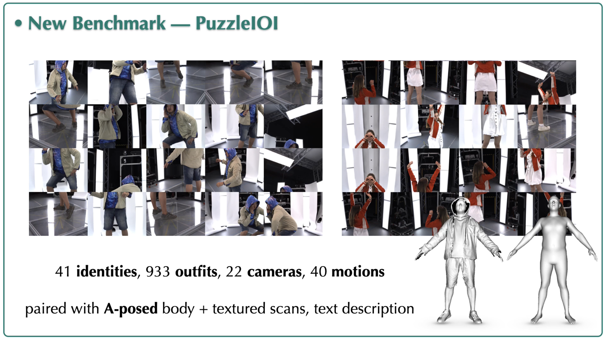

<p align="center">

  <h2 align="center">PuzzleAvatar:<br> Assembly of Avatar from Unconstrained Photo Collections</h2>
  <p align="center">
    <a href="https://xiuyuliang.cn/"><strong>Yuliang Xiu</strong></a>
    ·
    <a href="https://judyye.github.io/"><strong>Yufei Ye</strong></a>
    ·
    <a href="https://itszhen.com/"><strong>Zhen Liu</strong></a>
    ·
    <a href="https://dtzionas.com/"><strong>Dimitris Tzionas</strong></a>
    ·
    <a href="https://ps.is.mpg.de/person/black"><strong>Michael J. Black</strong></a>
    <br>
  </p>
  <h3 align="center">SIGGRAPH Asia 2024 (Journal Track)</h3>

  <div align="center">
    
  </div>

  <p align="center">
  </br>
    <a href="https://arxiv.org/abs/2405.14869">
      
    </a>
    <a href='https://puzzleavatar.is.tue.mpg.de/'>
      </a>
    <a href="https://youtu.be/0hpXH2tVPk4"></a>
  </p>
</p>

<div align="center">

PuzzleAvatar reconstructs a textured 3D clothed human from **unconstrained photo collections**.

|             Works On              |      Without Requiring or Being Limited by      |
| :-------------------------------: | :---------------------------------------------: |
|      ✅ Any number of photos      | ❌ Human body pose (3D HPS, 2D Keypoints, etc.) |
|          ✅ In any poses          |                 ❌ Camera pose                  |
|         ✅ From any views         |     ❌ Geometric cues (depth, normal, etc.)     |
| ✅ With any cropping or occlusion |             ❌ Re-projection losses             |
| ✅ Any A-posed body mesh template |  ❌ SMPL-(X/H), GHUM, Frank, Adam, SCAPE, etc   |

</div>

<br/>

## News :triangular_flag_on_post:

- [2024/11/09] [PuzzleIOI](https://github.com/YuliangXiu/PuzzleAvatar?tab=readme-ov-file#dataset-and-benchmark) dataset and benchmark code get released.
- [2024/09/10] [PuzzleAvatar](https://github.com/YuliangXiu/PuzzleAvatar) code gets released.
- [2024/05/23] [PuzzleAvatar](https://arxiv.org/abs/2405.14869) paper gets released.

<br/>

## Getting Started

1. Set up the paths in `scripts/env.sh`.
2. Please follow the [Installation Instruction](install.md) to setup all the required packages.
3. Run PuzzleAvatar (Grounded-SAM $\rightarrow$ PuzzleBooth $\rightarrow$ SDS, takes about 4 hours)

```bash
# For custom data
bash scripts/run.sh data/human/yuliang results/human/yuliang human_yuliang

# For PuzzleIOI
bash scripts/run.sh data/PuzzleIOI/puzzle_capture/03632/outfit13 results/PuzzleIOI/puzzle_capture/03632/outfit13 03632_outfit13
```

The results will be saved in the experiment folder `results/human/yuliang`, and `results/PuzzleIOI/puzzle_capture/03632/outfit13`.

<div align="center">
    
</div>

## Dataset and Benchmark

<div align="center">
    
</div>

1. Register at [puzzleavatar.is.tue.mpg.de](https://puzzleavatar.is.tue.mpg.de/)
2. Download datasets (194GB) with registered *username* and *password*
```bash
bash scripts/fetch_data.sh
```
3. For evaluation / benchmark
```bash
# render the reconstruction results (4 views)
python -m render.render_batch_result -headless -out_dir ./results/ -split test

# calculate both 3D metrics (Chamfer, P2S, NC) and 2D metrics (PSNR, SSIM, LPIPS)
python -m multi_concepts.benchmark -split test
```

## Acknowledgment

This implementation is built based on [TeCH](https://github.com/huangyangyi/TeCH), [Break-A-Scene](https://github.com/google/break-a-scene), [Grounded SAM](https://github.com/IDEA-Research/Grounded-Segment-Anything), [GPT-4V(ision)](https://openai.com/index/gpt-4v-system-card/), [Stable Diffusion 2-1-base](https://huggingface.co/stabilityai/stable-diffusion-2-1-base), [BOFT-DreamBooth](https://github.com/huggingface/peft/blob/main/examples/boft_dreambooth/train_dreambooth.py), [Stable Dreamfusion](https://github.com/ashawkey/stable-dreamfusion), [ECON](https://github.com/YuliangXiu/ECON).

This project has received funding from the European Union’s Horizon 2020 research and innovation programme under the Marie Skłodowska-Curie grant agreement No.860768 ([CLIPE Project](https://www.clipe-itn.eu))

Kudos to all of our amazing contributors! PuzzleAvatar thrives through open-source. In that spirit, we welcome all kinds of contributions from the community.

<a href="https://github.com/yuliangxiu/PuzzleAvatar/graphs/contributors">
  
</a>

_Contributor avatars are randomly shuffled._

## License

This code and model are available for non-commercial scientific research purposes as defined in the [LICENSE](LICENSE) file. By downloading and using the code and model you agree to the terms in the [LICENSE](LICENSE).

## Disclosure

MJB has received research gift funds from Adobe, Intel, Nvidia, Meta/Facebook, and Amazon. MJB has financial interests in Amazon and Meshcapade GmbH. While MJB is a co-founder and Chief Scientist at Meshcapade, his research in this project was performed solely at, and funded solely by, the Max Planck Society.

## Contact

For technical questions, please contact yuliang.xiu@tue.mpg.de

For commercial licensing, please contact ps-licensing@tue.mpg.de

## Citation

```bibtex
@article{xiu2024puzzleavatar,
  title={PuzzleAvatar: Assembling 3D Avatars from Personal Albums},
  author={Xiu, Yuliang and Ye, Yufei and Liu, Zhen and Tzionas, Dimitrios and Black, Michael J},
  journal={ACM Transactions on Graphics (TOG)},
  year={2024},
  publisher={ACM New York, NY, USA}
}
```

PuzzleAvatar is mainly built upon [TeCH](https://github.com/huangyangyi/TeCH), please also kindly cite it

```bibtex
@inproceedings{huang2024tech,
  title={{TeCH: Text-guided Reconstruction of Lifelike Clothed Humans}},
  author={Huang, Yangyi and Yi, Hongwei and Xiu, Yuliang and Liao, Tingting and Tang, Jiaxiang and Cai, Deng and Thies, Justus},
  booktitle={International Conference on 3D Vision (3DV)},
  year={2024}
}
```
